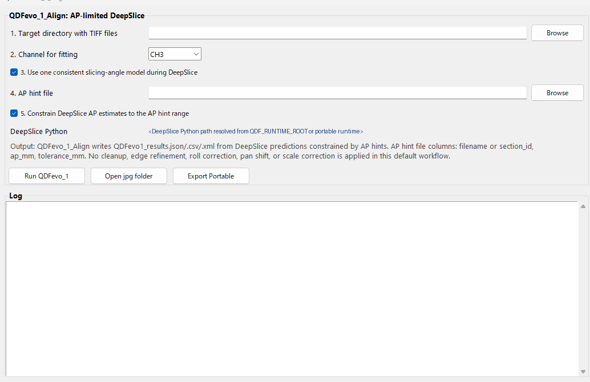
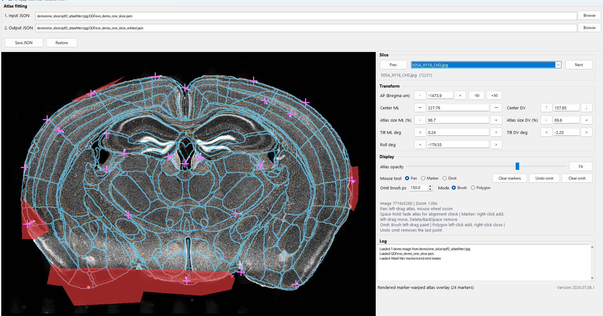

# Quint Deep Flow evo

Quint Deep Flow evo is a three-step desktop workflow for mouse brain section atlas fitting and quantification.

It contains:

- `QDFevo_1_Align`: AP-limited DeepSlice alignment from TIFF section images.
- `QDFevo_2_AtlasFitter`: manual atlas fitting, marker-based local adjustment, and omit-region editing.
- `QDFevo_3_Quantitate`: cell quantification from `QDFevo_2_AtlasFitter` output, including omit-mask aware summaries.

The repository includes one small demo slice under `demo/one_slice`.

## Functions

### QDFevo_1_Align

`QDFevo_1_Align` estimates the AP position and initial atlas alignment for brain section images with DeepSlice. Adding an AP hint CSV lets the workflow restrict AP estimation to a user-defined range, which is useful when the expected section level is already known. For robust regional position estimation, DAPI-stained section images are recommended.

### QDFevo_2_AtlasFitter

`QDFevo_2_AtlasFitter` lets users intuitively manually refine the brain slice position estimated by `QDFevo_1_Align`. It supports AP position, image rotation, atlas size, and center-position transforms, marker-based intuitive non-linear fitting, and omit-region editing for damaged or contaminated areas that should be partially excluded from later analysis.

### QDFevo_3_Quantitate

`QDFevo_3_Quantitate` performs cell quantification using the edited JSON and omit masks produced by `QDFevo_2_AtlasFitter`. Omit regions are treated as masks: cells overlapping the mask are flagged/excluded from summary counts, and region area is reduced only by the masked pixels rather than removing the entire atlas region.

## GUI screenshots

The input paths and log messages shown below are sanitized for public documentation.

### QDFevo_1_Align



### QDFevo_2_AtlasFitter



## Repository layout

```text
launch_QDFevo_1_Align.bat          Start QDFevo_1_Align on Windows
launch_QDFevo_2_AtlasFitter.bat    Start QDFevo_2_AtlasFitter on Windows
launch_QDFevo_2.bat                Short alias for QDFevo_2_AtlasFitter
launch_QDFevo_3_Quantitate.bat     Start QDFevo_3_Quantitate on Windows
launch_QDFevo_3.bat                Short alias for QDFevo_3_Quantitate
app/                               Python GUI and processing code
atlas/ccf/                         Minimal Allen CCF metadata/annotation for demo display
demo/one_slice/                    One-slice demo data
docs/GITHUB_PUBLISH_STEPS.md       Publishing checklist and GitHub upload steps
```

## Requirements

Recommended environment:

- Windows 10/11
- Python 3.11
- A DeepSlice-capable Python environment for `QDFevo_1_Align`

Install the GUI/runtime dependencies with:

```powershell
py -3.11 -m venv .venv
.\.venv\Scripts\python -m pip install --upgrade pip
.\.venv\Scripts\python -m pip install -r requirements.txt
```

If you already have a QUINTdeepflow portable runtime, set:

```powershell
$env:QDF_RUNTIME_ROOT = "C:\Users\<you>\Documents\QDF_portable"
```

The launchers also try `%USERPROFILE%\Documents\QDF_portable` automatically.

## Start the apps

From Explorer, double-click:

```text
launch_QDFevo_1_Align.bat
launch_QDFevo_2_AtlasFitter.bat
launch_QDFevo_2.bat
launch_QDFevo_3_Quantitate.bat
launch_QDFevo_3.bat
```

Or from PowerShell:

```powershell
.\launch_QDFevo_1_Align.bat
.\launch_QDFevo_2_AtlasFitter.bat
.\launch_QDFevo_2.bat
.\launch_QDFevo_3_Quantitate.bat
.\launch_QDFevo_3.bat
```

If no portable runtime is found, the launchers fall back to `python` on `PATH`. In that case, activate your virtual environment first:

```powershell
.\.venv\Scripts\Activate.ps1
.\launch_QDFevo_2_AtlasFitter.bat
```

## Demo: QDFevo_1_Align

1. Launch `launch_QDFevo_1_Align.bat`.
2. Set `Target directory with TIFF files` to:

```text
demo\one_slice\qdf1_align\raw
```

3. Set `Channel for fitting` to `CH3`.
4. Optional: set `AP hint file` to:

```text
demo\one_slice\qdf1_align\ap_hints_xy01.csv
```

5. Click `Run QDFevo_1`.

The demo TIFF is downsampled to keep the repository small. It demonstrates the workflow, not final scientific accuracy.

## Demo: QDFevo_2_AtlasFitter

1. Launch `launch_QDFevo_2_AtlasFitter.bat`.
2. Click `Browse` for `Input JSON`.
3. Select:

```text
demo\one_slice\qdf2_atlasfitter\jpg\QDFevo_demo_one_slice.json
```

4. The adjacent image `505A_XY01_CH3.jpg` is loaded automatically.
5. Use pan/marker/omit tools to inspect or edit the atlas fit.
6. Click `Save JSON` to write changes. Omit edits are saved beside the JSON as `*_omit_state.json` and `*_omitMasks`.

## QDFevo_3_Quantitate outputs

`QDFevo_3_Quantitate` takes raw images, ilastik/segmentation masks, and the edited `QDFevo_2_AtlasFitter` JSON as input. The main output folder contains:

- `cell_level.csv`: per-cell quantification table. When omit masks are applied, `omit_flag` and `omit_source` identify cells overlapping omitted areas.
- `region_summary.csv`: per-region cell counts, intensity summaries, area, density, and overlap-set summaries after excluding omitted cells and subtracting masked area.
- `section_summary.csv`: per-section summary generated from non-omitted cells.
- `processing_log.csv`: processing status, timing, and errors for each section/channel.
- `discovery_table.csv`: matched raw image, segmentation mask, and atlas JSON inputs.
- `atlas_display_codebook.csv`: atlas display-code lookup used in overlays.
- `overlay/*_overlay_full.tiff`: multi-plane overlay image including raw image, cell ROI, atlas outline/display code, and `omit_region_mask`.
- `overlay/*_multichannel_channel_maps.xlsx`: plane map describing each overlay TIFF channel.
- `qdf1_atlasfitter_imported_omit_regions.csv`: reference report of atlas patches touched by imported omit masks.
- `qdf1_atlasfitter_imported_omit_session.yaml`: QDF3-compatible reference session generated from imported omit masks.

## What to be careful about

- `QDFevo_1_Align` needs a DeepSlice-capable environment. The regular Python dependencies in `requirements.txt` are not enough for DeepSlice prediction.
- The demo data are reduced to one section and should not be treated as a full validation dataset.
- The source code is released under the MIT License.
- Atlas files and demo image data may be subject to their original data-source terms and are not relicensed by the MIT License unless explicitly permitted by their original providers.

## License

The source code in this repository is licensed under the MIT License. See `LICENSE`.

Atlas files, demo images, and other third-party or experimental data remain subject to their original data-source terms.

## GitHub publication

See:

```text
docs\GITHUB_PUBLISH_STEPS.md
```
